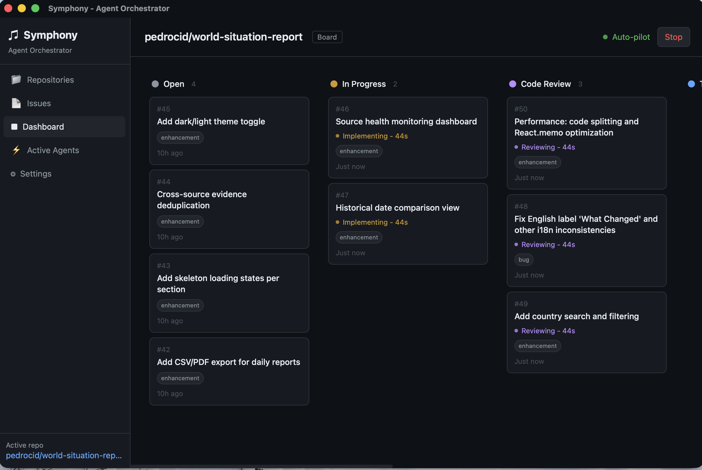
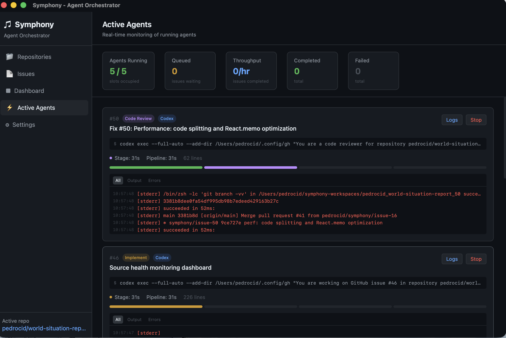

# Symphony Mac

A macOS desktop application that orchestrates AI coding agents to automatically implement, review, test, and merge GitHub issues.

Built with Tauri v2 (Rust backend + React frontend). Inspired by [OpenAI's Symphony](https://github.com/openai/symphony), which orchestrates autonomous coding agents against Linear tasks. Symphony Mac brings the same concept to a native macOS app with a visual Kanban board, GitHub Issues integration, and support for both Claude Code and Codex CLI.



## What It Does

Symphony connects to your GitHub repositories, picks up open issues, and launches AI agents ([Claude Code](https://docs.anthropic.com/en/docs/claude-code) or [Codex CLI](https://github.com/openai/codex)) to work through a fully automated pipeline. Each issue progresses through discrete stages, with a separate agent subprocess handling each one.

You select a repo, start the orchestrator, and Symphony takes care of the rest: implementing features, reviewing code, running tests, and merging PRs -- all in parallel across multiple issues.

## Pipeline

Each issue flows through four stages. On success, the next stage launches automatically. On failure, the stage can be retried (automatically or manually).

```
Implement  -->  Code Review  -->  Testing  -->  Merge  -->  Done
```

| Stage | What the Agent Does |
|-------|---------------------|
| **Implement** | Reads the issue, writes code, commits, creates a PR |
| **Code Review** | Checks out the PR, reviews for bugs/security/style, fixes issues |
| **Testing** | Runs the project's test suite + E2E validation, fixes failures |
| **Merge** | Rebases against main, resolves conflicts, merges the PR, closes the issue |

After merge, Symphony verifies the PR was actually merged (not blocked by conflicts) before marking it as Done.

## Screenshots

### Kanban Dashboard

Issues move across columns as they progress through the pipeline:


### Active Agents

Real-time monitoring of running agent subprocesses with streaming logs:



## Prerequisites

- **macOS** (native desktop app)
- **GitHub CLI** (`gh`) -- installed and authenticated (`gh auth login`)
- At least one AI agent CLI:
  - [Claude Code](https://docs.anthropic.com/en/docs/claude-code) (`claude`) -- recommended
  - [Codex CLI](https://github.com/openai/codex) (`codex`)
- **Node.js** and **Rust** toolchain (for building from source)

## Install

### From Source

```bash
git clone https://github.com/pedrocid/SymphonyMac.git
cd SymphonyMac
npm install
npx tauri build
```

The built app is at `src-tauri/target/release/bundle/macos/Symphony Mac.app`. Copy it to `/Applications/` to install.

### Development

```bash
npm install
npx tauri dev
```

## Usage

1. Open Symphony Mac
2. Go to **Repositories** and select a GitHub repo
3. Go to **Dashboard** to see the Kanban board
4. Click **Auto-pilot** to start the orchestrator -- it will poll for open issues and begin working
5. Or click **Run** on individual issues to launch them manually
6. Monitor progress in **Active Agents** with real-time streaming logs
7. Failed tasks can be retried with the **Retry** button

## Configuration

All settings are available in the **Settings** page:

| Setting | Default | Description |
|---------|---------|-------------|
| Agent type | `claude` | Which CLI to use (`claude` or `codex`) |
| Auto approve | `true` | Skip permission prompts in agent CLI |
| Max concurrent | `3` | Maximum parallel agent subprocesses |
| Poll interval | `60s` | Seconds between issue polling cycles |
| Issue label | none | Only process issues with this label |
| Max retries | `1` | Retry attempts per failed stage |
| Retry backoff | `10s` | Delay before retrying a failed stage |
| Workspace TTL | `7 days` | Auto-delete workspaces older than this |

## How It Works

### Workspace Isolation

Each issue gets its own cloned workspace so agents never interfere with each other:

```
~/symphony-workspaces/
  owner_repo_1/    # Clone for issue #1
  owner_repo_2/    # Clone for issue #2
  owner_repo_17/   # Clone for issue #17
```

Repos are shallow-cloned via `gh repo clone`. A dedicated branch `symphony/issue-N` is created per issue. Workspaces are cleaned up after pipeline completion or after the configured TTL expires.

### Streaming Logs

When using Claude Code, Symphony uses `--output-format stream-json --verbose` to get real-time events as the agent works. You'll see tool calls (file reads, edits, bash commands), results, and assistant messages as they happen -- not just at the end.

### Merge Conflict Handling

Since multiple agents may work in parallel and merge PRs concurrently, Symphony handles merge conflicts:
- The merge agent rebases against main before merging to detect conflicts early
- After the agent finishes, Symphony verifies the PR state is actually "MERGED" via `gh pr view`
- If the merge failed silently (e.g. due to conflicts), the task is marked as failed instead of advancing to Done

### GitHub Integration

All GitHub operations use the `gh` CLI -- no API tokens needed beyond what `gh auth` provides. This includes listing repos, fetching issues, creating PRs, merging, and closing issues.

## Architecture

```
Tauri v2 App
  Frontend (React + TypeScript + Tailwind CSS)
    App.tsx ............ Sidebar navigation
    Dashboard.tsx ...... Kanban board
    ActiveAgents.tsx ... Real-time agent monitoring
    LogViewer.tsx ...... Streaming log viewer
    Settings.tsx ....... Configuration

  Backend (Rust)
    orchestrator.rs .... Poll loop, state management, dispatch
    agent.rs ........... Prompt builder, subprocess exec, auto-chaining
    github.rs .......... gh CLI wrapper (repos, issues, PRs)
    workspace.rs ....... Clone/cleanup isolated workspaces
    report.rs .......... Pipeline report generation
    logs.rs ............ Persistent log storage
    notification.rs .... macOS notifications
    dock.rs ............ Dock badge updates
    paths.rs ........... CLI tool resolution
```

## License

MIT
